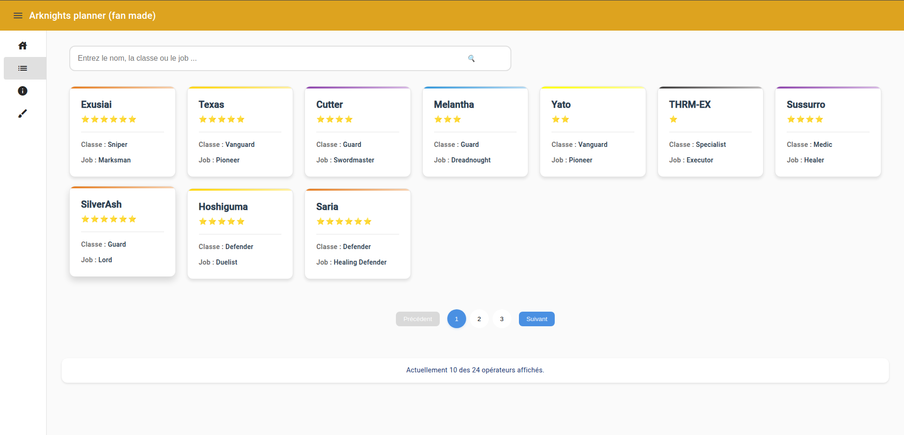

# Planner For Arknights ♟️

Ce projet a été généré à l'aide de [Angular CLI](https://github.com/angular/angular-cli) version 19.0.6.

## ✨ Introduction : 

Bienvenu sur mon projet Planner for Arknights (plannificateur). 
Je me suis lancé dans ce projet pour :
  - Améliorer mes compétences et apprendre les bases du framework Angular
  - Rendre de nouveau accessible une fonctionalité d'un site aujourd'hui inutilisable : la plannification pour développer un opérateur

## 🎯 Objectifs : 

 1. ### Mettre en place les layouts du site : 
    - Header, Footer et SideBar pour naviguer dans le site.
 2. ### Consulter une liste d'opérateur :
    - Extraire les données d'un fichier JSON.
    - Visualisation simple et claire des opérateurs.
 3. ### Détails des opérateurs : 
    - En cliquant sur l'une des carte de la liste, on peut consulter les infos en détails (stats, compétences, etc.).
 4. ### Mise en place d'un planner :
    - Permettre de calculer étape par étape les ressources nécessaires pour développer un opérateur.
 5. ### Optimisation UX :
    - Rendre l'expérience utilisateur agréable, fluide et intuitive.
 

## 🚀 Fonctionnalités déjà implémentées
- ✅ Layout initial (Header/Footer/SideBar) fonctionnel.
- ✅ Chargement dynamique d'une liste d'opérateurs depuis un fichier JSON.
- 🏗️ Consultation des détails d'un opérateur spécifique.

## 🖼️ Démo :

### Liste des opérateurs

Comme illustré dans l'impression écran ci-dessous, vous pouvez parcourir une liste complète d'opérateurs. Chaque opérateur est affiché avec ses informations principales et est cliquable pour obtenir plus de détails.

### Détails d'un opérateur
Détails d'un opérateur (Work in Progress)
Une fois qu'un opérateur est sélectionné, sa fiche détaillée s'affiche (capture à venir 🚧).

## 🛠️ Technologie utilisée : 

- Framework : Angular.
- Langages: TypeScript, Html, scss.
- Gestions de données : Fichier JSON local (temporaire, une API sera utilisé dans le futur).
- Versionnement : Git

## 🏗️  Étapes futures

- ⬜ Mettre en place des filtres pour trier les opérateurs (par classe, rareté, etc.).
- ⬜ Développer la partie planner
- ⬜ Créer la partie Back-end pour gérer et mettre à jours les données.
- ⬜ Héberger le projet sur une plateforme publique (GitHub Pages ou autre).

## Conclusion : 

Ce projet est en Work in Progress et surtout un projet long terme qui j'espère sera fonctionel et sera utile pour d'autres personnes. 
